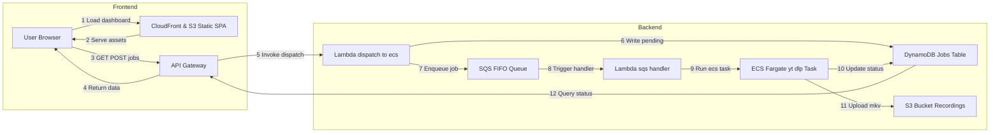

```markdown
# YouTube Live-Stream Recorder

A turnkey, serverless system for on-demand recording of YouTube Live streams. Submit a live-URL via a dashboard or CLI, and the system will:

1. Enqueue your request in an SQS FIFO queue.  
2. Dispatch a Lambda → ECS Fargate task to record in highest quality (`yt-dlp`).  
3. Track real-time progress and heartbeats in DynamoDB.  
4. Upload the final `.mkv` into S3.  
5. Serve a React/Tailwind/shadcn dashboard (OLED dark + olive accent) via CloudFront.

---

## Architecture Overview

```text
[ Client (SPA) ] ─▶ S3/CF (UI) ─▶ API Gateway ─▶ Lambda (dispatch_to_ecs) ─▶ SQS FIFO ─▶ Lambda ─▶ ECS Task (yt-dlp) ─▶ S3
                                 │                                     │
                                 └──────────▶ DynamoDB (jobs table) ◀──┘
```



- **`terraform/backend/`**: VPC, subnets, ECS cluster & task definition, IAM roles, SQS FIFO + DLQ, Lambda dispatcher, DynamoDB jobs table, API Gateway REST API.  
- **`terraform/frontend/`**: S3 bucket + OAI, CloudFront distribution with HTTPS (ACM), optional Route53 for custom domain.  
- **`web/`**: Next.js + TypeScript + Tailwind + shadcn UI SPA that polls job status every 5 s, displays cards, and offers an inline modal to submit new jobs.  
- **`util/`**: Helper scripts (`build-web.sh`, `add_to_queue.sh`, `dl-strm.sh`) for building the static site, enqueuing jobs, and local stream grabs.

---

## Development Setup

### 1. Backend (terraform/backend)

```bash
cd terraform/backend
terraform init

# On first run only: provision VPC & networking
terraform apply \
  -target=aws_vpc.this \
  -target=aws_internet_gateway.igw \
  -target=aws_public_subnet.public \
  -target=aws_route_table.public \
  -target=aws_route_table_association.public \
  -target=aws_security_group.ecs_tasks

# Then provision the rest of the infrastructure
terraform apply
```

Track the outputs for your ECS cluster name, task definition ARN, SQS queue URL, DynamoDB table name, and API endpoint URL.

### 2. Frontend Infra (terraform/frontend)

```bash
cd terraform/frontend
terraform init
terraform apply
```

Capture the S3 bucket name and CloudFront domain from the outputs.

### 3. Local Web Development (web/)

1. Install dependencies:
   ```bash
   cd web
   npm install
   ```
2. Create `.env.local`:
   ```env
   NEXT_PUBLIC_API_URL=https://<api-id>.execute-api.us-east-1.amazonaws.com/prod
   NEXT_PUBLIC_POLL_INTERVAL=5000
   ```
3. (Optional) Mock the API:
   ```bash
   npm install --save-dev json-server
   # create mock/db.json with a "jobs" array
   npm run mock
   ```
4. Launch the dev server:
   ```bash
   npm run dev
   ```
   Visit http://localhost:3000 to see the dashboard.

### 4. Helper Scripts (util/)

- **build-web.sh**: Installs, builds, and exports your Next.js app into `web/out/`.  
- **add_to_queue.sh**: Enqueues a new recording job (generates UUID, computes S3 key).  
- **dl-strm.sh**: Legacy local stream grabber using `yt-dlp`.

---

## Docker Image & ECS Task

Your container image installs `yt-dlp`, `ffmpeg`, and the AWS CLI. It uses `entrypoint.sh` to:

1. Update DynamoDB to `RECORDING`.  
2. Launch `yt-dlp`.  
3. Emit heartbeats (file size + timestamp) every minute.  
4. Update DynamoDB to `UPLOADING` and then `COMPLETED` (or `FAILED` with an error snippet).  
5. Upload the `.mkv` to S3 under the provided key.

Push this image to ECR and reference it in your ECS task definition for Fargate.

---

## DevOps & Operational Considerations

From an operational standpoint, this design emphasizes decoupling, observability, and security. Jobs are first placed in SQS, which guarantees at-least-once delivery and can be monitored or replayed if needed. The Lambda dispatcher validates each YouTube URL before spinning up a Fargate task, preventing wasted compute on non-existent streams. Real-time status—including precise “started,” “recording,” “uploading,” and “completed” milestones—is persisted in DynamoDB, along with periodic heartbeats and byte counts, giving you a granular view of in-flight recordings.

IAM roles follow the principle of least privilege: the ECS task role can only write to its designated S3 bucket and update its DynamoDB record; the Lambda role can only pull from SQS, invoke ECS, and write to DynamoDB. CloudWatch Logs capture both Lambda and container output, and you can configure alarms on error metrics or Lambda failures. A TTL policy on the DynamoDB table ensures old job records expire automatically, and CloudFront serves your static dashboard with minimal latency and cost.

Deployment pipelines should separate concerns: backend infrastructure changes (Terraform in `terraform/backend`) run independently of frontend hosting updates (`terraform/frontend` plus S3 sync and CloudFront invalidation). The static site build (via `util/build-web.sh`) can be integrated into GitHub Actions, which on each merge to `main` will build and deploy the UI, then invalidate CloudFront. Simultaneously, code changes to `entrypoint.sh` or Lambda functions trigger a separate pipeline that builds and pushes a new container image to ECR, followed by a Terraform apply for the backend.

This one-pager should guide both developers and DevOps engineers through setup, local development, and production deployment, while preserving a robust, secure, and observable architecture for on-demand YouTube Live recording.
