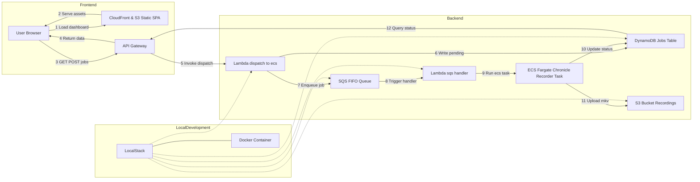

# :floppy_disk: chronicle

A turnkey, serverless system for on-demand recording of livestreams. Submit a live-URL via a dashboard or CLI, and the system will:

1. Enqueue your request in an SQS FIFO queue.  
2. Dispatch a Lambda → ECS Fargate task to record in highest quality (`yt-dlp`).  
3. Track real-time progress and heartbeats in DynamoDB.  
4. Upload the final `.mkv` into S3.  
5. Create a torrent file and seed it through transmission for P2P sharing.
6. Serve a React/Tailwind/shadcn dashboard (OLED dark + olive accent) via CloudFront.

---

## Development Philosophy: LocalStack for Development, Terraform for Production

This project follows a "develop locally, deploy globally" philosophy:

- **LocalStack for Development**: The entire system can be run locally using LocalStack, which simulates AWS services without requiring an AWS account or internet connection. This enables:
  - **Rapid iteration**: Test changes immediately without waiting for cloud deployments
  - **Cost efficiency**: No AWS charges during development
  - **Offline development**: Work without internet access
  - **Simplified debugging**: Inspect services locally with direct access to logs
  - **Consistent environment**: Every developer works with identical local setups
  - **CI/CD integration**: Automated testing pipelines can use LocalStack to validate infrastructure changes

- **Terraform for Production**: When ready for production, the same application code deploys to real AWS services using Terraform:
  - **Infrastructure as Code**: Reproducible deployments across environments
  - **Seamless transition**: No code changes needed between local and production
  - **Resource management**: Proper networking, security, and scaling configurations
  - **Cost optimization**: Right-sized resources based on production needs

This dual approach provides the best of both worlds: fast, free local development with a clear path to production deployment.

---

## DevOps & Operational Considerations

From an operational standpoint, this design emphasizes decoupling, observability, and security. Jobs are first placed in SQS, which guarantees at-least-once delivery and can be monitored or replayed if needed. The Lambda dispatcher validates each stream URL before spinning up a Fargate task, preventing wasted compute on non-existent streams. Real-time status—including precise "started," "recording," "uploading," and "completed" milestones—is persisted in DynamoDB, along with periodic heartbeats and byte counts, giving you a granular view of in-flight recordings.

IAM roles follow the principle of least privilege: the ECS task role can only write to its designated S3 bucket and update its DynamoDB record; the Lambda role can only pull from SQS, invoke ECS, and write to DynamoDB. CloudWatch Logs capture both Lambda and container output, and you can configure alarms on error metrics or Lambda failures. A TTL policy on the DynamoDB table ensures old job records expire automatically, and CloudFront serves your static dashboard with minimal latency and cost.

Deployment pipelines should separate concerns: backend infrastructure changes (Terraform in `terraform/backend`) run independently of frontend hosting updates (`terraform/frontend` plus S3 sync and CloudFront invalidation). The static site build (via `util/build-web.sh`) can be integrated into GitHub Actions, which on each merge to `main` will build and deploy the UI, then invalidate CloudFront. Simultaneously, code changes to `entrypoint.sh` or Lambda functions trigger a separate pipeline that builds and pushes a new container image to ECR, followed by a Terraform apply for the backend.

The Docker container handling has been enhanced to work both with ECS in production and with LocalStack locally, using the same entrypoint script. The Lambda function detects the environment and adjusts its behavior accordingly, providing a seamless transition between local and cloud deployments.

---

## Docker Image & ECS Task

The system uses a Docker container for livestream recording that works seamlessly in both production (ECS Fargate) and local (LocalStack) environments.

The `docker/ecs/Dockerfile` installs:
- Python 3.11 with the latest `yt-dlp`
- FFmpeg for media processing
- AWS CLI for S3 uploads and DynamoDB updates

The container's entrypoint script (`entrypoint.sh`) provides:
1. Environment detection to work with both AWS and LocalStack
2. DynamoDB status updates throughout the recording lifecycle
3. Periodic heartbeats with download progress
4. Error handling with detailed logs
5. S3 uploading of the final recording

In production, this image is pushed to ECR and referenced in your ECS task definition for Fargate. For local development, the Lambda function in LocalStack can spawn this container directly via the Docker socket.

### Frontend Docker Container

The frontend web application is containerized to simplify development and deployment:

The `docker/web/Dockerfile` provides:
1. A multi-stage build with development and production targets
2. Hot reloading for local development
3. Optimized production builds with Next.js standalone output

**Development Mode**:
```bash
# Start the development server with hot reloading
./util/build_web_docker.sh dev
```

**Production Mode**:
```bash
# Build production image and test locally
./util/build_web_docker.sh prod run

# Build production image for deployment
./util/build_web_docker.sh prod push
```

The production container can be deployed to any container hosting service (ECS, EKS, AppRunner, etc.) or used with a container registry in your CI/CD pipeline.

---

## Architecture Overview



- **`terraform/backend/`**: VPC, subnets, ECS cluster & task definition, IAM roles, SQS FIFO + DLQ, Lambda dispatcher, DynamoDB jobs table, API Gateway REST API.  
- **`terraform/frontend/`**: S3 bucket + OAI, CloudFront distribution with HTTPS (ACM), optional Route53 for custom domain.  
- **`web/`**: Next.js + TypeScript + Tailwind + shadcn UI SPA that polls job status every 5 s, displays cards, and offers an inline modal to submit new jobs.  
- **`util/`**: Helper scripts (`build-web.sh`, `add_to_queue.sh`, `dl-strm.sh`) for building the static site, enqueuing jobs, and local stream recordings.
- **`docker/localstack/`**: Configuration files and scripts for running AWS services locally with LocalStack.
- **`docker/web/`**: Docker configuration for frontend development and deployment.
- **`docker/ecs/`**: Docker configuration for backend stream recording container.

---

## Production Deployment

### 1. Backend (terraform/backend)

```bash
cd terraform/backend
terraform init

# On first run only: provision VPC & networking
terraform apply \
  -target=aws_vpc.this \
  -target=aws_internet_gateway.igw \
  -target=aws_public_subnet.public \
  -target=aws_route_table.public \
  -target=aws_route_table_association.public \
  -target=aws_security_group.ecs_tasks

# Then provision the rest of the infrastructure
terraform apply
```

Track the outputs for your ECS cluster name, task definition ARN, SQS queue URL, DynamoDB table name, and API endpoint URL.

### 2. Frontend Infra (terraform/frontend)

```bash
cd terraform/frontend
terraform init
terraform apply
```

Capture the S3 bucket name and CloudFront domain from the outputs.

### 3. Local Development 

#### 3.1 Backend (`localstack`)

LocalStack provides a fully functional local AWS cloud stack that allows you to develop and test your cloud applications without connecting to AWS.

1. **Prerequisites**:
   - Docker and Docker Compose installed
   - AWS CLI (optional, but recommended)
   - Python (optional, for SDK usage)

2. **Setup LocalStack**:
   ```bash
   cd docker/localstack
   docker compose up -d
   ```
   
   The `docker-compose.yml` configures LocalStack with:
   - All required AWS services: S3, SQS, DynamoDB, Lambda, API Gateway, and CloudWatch Logs
   - Volume mounting for persistent data storage
   - Lambda Docker execution mode to run containers locally
   - Exposed port 4566 for all AWS service APIs

3. **Verify LocalStack is Running**:
   ```bash
   curl http://localhost:4566/health
   ```

4. **Initialize LocalStack Environment**:
   ```bash
   cd docker/localstack
   ./localstack_setup.sh
   ```
   This script performs the following setup tasks:
   - Creates an S3 bucket for recordings (`chronicle-recordings-dev`)
   - Creates a DynamoDB table for job tracking (`jobs`) with TTL enabled
   - Sets up SQS FIFO queue (`chronicle-jobs.fifo`) and DLQ (`chronicle-jobs-dlq.fifo`)
   - Packages and deploys the Lambda function (`dispatch-to-ecs`)
   - Configures API Gateway with `/jobs` endpoint supporting GET and POST methods
   - Sets up SQS event source mapping for the Lambda

5. **Configure Environment Variables**:
   ```bash
   export AWS_ENDPOINT_URL=http://localhost:4566
   export AWS_ACCESS_KEY_ID=test
   export AWS_SECRET_ACCESS_KEY=test
   export AWS_DEFAULT_REGION=us-east-1
   ```

6. **Use Helper Scripts with LocalStack**:
   ```bash
   # Submit a job to the queue
   ./util/add_to_queue.sh "https://www.youtube.com/watch?v=LIVE_STREAM_ID"
   
   # Or use the dummy script for testing
   ./util/add_to_queue_dummy.sh
   
   # Build and reset the LocalStack environment
   ./util/build_backend_localstack.sh
   
   # Clean up LocalStack environment
   ./util/build_backend_clean.sh
   ```

7. **Run a Local Docker Container**:
   The Lambda dispatch function can run Docker containers locally when using LocalStack. The container uses the same `entrypoint.sh` script for both production and local environments:
   
   - Automatically detects LocalStack environment via `AWS_ENDPOINT_URL`
   - Updates job status in DynamoDB at each stage (RECORDING, UPLOADING, COMPLETED/FAILED)
   - Emits heartbeats with download progress every 60 seconds
   - Uploads recordings to S3 upon completion
   - Handles error conditions and updates job status accordingly

### 3.2 Frontend (`web/`)

1. Install dependencies:
   ```bash
   cd web
   npm install
   ```
2. Create `.env.local`:
   ```env
   NEXT_PUBLIC_API_URL=https://<api-id>.execute-api.us-east-1.amazonaws.com/prod
   NEXT_PUBLIC_POLL_INTERVAL=5000
   ```
3. (Optional) Mock the API:
   ```bash
   npm install --save-dev json-server
   # create mock/db.json with a "jobs" array
   npm run mock
   ```
4. Launch the dev server:
   ```bash
   npm run dev
   ```
   Visit http://localhost:3000 to see the dashboard.

### 4. Helper Scripts (util/)

The project includes several utility scripts to simplify common development and operational tasks:

- **build_web.sh**: Installs dependencies, builds, and exports the Next.js app into `web/out/` for deployment to S3.  
- **add_to_queue.sh**: Enqueues a new recording job by:
  ```bash
  # Format: add_to_queue.sh <QUEUE_URL> <STREAM_URL> [FILENAME] [S3_PREFIX]
  ./util/add_to_queue.sh "https://sqs.us-east-1.amazonaws.com/000000000000/chronicle-jobs.fifo" "https://www.youtube.com/watch?v=LIVE_ID" "my-recording.mkv"
  ```
  This generates a UUID for the job, computes the S3 key, and sends the message to SQS FIFO.
  
- **add_to_queue_dummy.sh**: Simplified version that enqueues a test job with defaults.

- **build_backend_localstack.sh**: One-command script to restart and initialize LocalStack:
  ```bash
  ./util/build_backend_localstack.sh
  ```
  This brings down any existing LocalStack container, starts a fresh one, and runs the setup script.

- **build_backend_clean.sh**: Cleans up LocalStack resources for a fresh start.

- **build_backend_docker.sh**: Builds and pushes the Docker image for production ECS deployment.

- **reset_and_run.sh**: Complete reset and test cycle for LocalStack:
  1. Tears down LocalStack and removes volumes
  2. Rebuilds the environment from scratch
  3. Enqueues a test job to verify functionality

- **dl-strm.sh**: Legacy local stream recorder using `yt-dlp` directly:
  ```bash
  ./util/dl-strm.sh "https://www.youtube.com/watch?v=LIVE_ID"
  ```
  Useful for testing stream recording without using the full AWS infrastructure.

---

## P2P Distribution with BitTorrent

Chronicle now supports peer-to-peer distribution of recorded content using BitTorrent:

1. After a recording is completed and uploaded to S3, the system automatically:
   - Creates a torrent file for the recording
   - Launches a transmission container to seed the torrent
   - Updates the job record with torrent information
   - Provides the torrent file for download in the web UI

2. **Benefits of the BitTorrent approach:**
   - Reduces bandwidth costs for S3 downloads
   - Provides a more reliable downloading experience for users
   - Allows for persistent access to content even after S3 files expire
   - Creates a distributed network of seeders if users continue to seed

3. **How it works:**
   - The recording container creates a torrent file with `transmission-create`
   - The torrent file is uploaded to S3
   - A dedicated transmission container is started to seed the content
   - Users can download either directly from S3 or via the torrent file
   - After S3 files expire, content remains available via the P2P network

4. **Resource management:**
   - Transmission containers are configured with resource limits
   - EFS storage is used for persistent seeding across container restarts
   - TTL settings ensure containers are terminated after sufficient seeding time

To use this feature, simply download the torrent file from the job details view and open it in your BitTorrent client.

---
