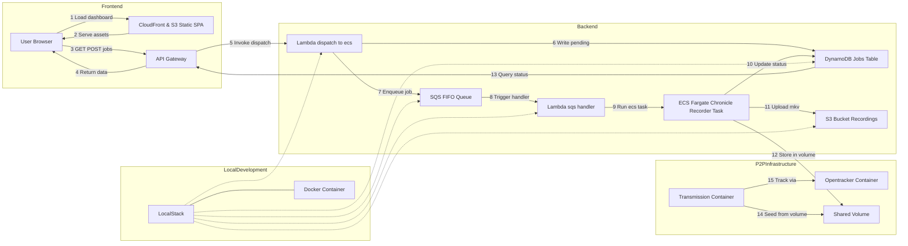

# :floppy_disk: chronicle

A turnkey, serverless system for on-demand recording of livestreams. Submit a live-URL via a dashboard or CLI, and the system will:

1. Enqueue your request in an SQS FIFO queue.  
2. Dispatch a Lambda → ECS Fargate task to record in highest quality (`yt-dlp`).  
3. Track real-time progress and heartbeats in DynamoDB.  
4. Upload the final `.mkv` into S3.  
5. Create a torrent file and seed it through transmission for P2P sharing.
6. Serve a React/Tailwind/shadcn dashboard (OLED dark + olive accent) via CloudFront.

## Table of Contents
- [Development Philosophy](#development-philosophy-localstack-for-development-terraform-for-production)
- [DevOps & Operational Considerations](#devops--operational-considerations)
- [Architecture Overview](#architecture-overview)
- [P2P Distribution with BitTorrent](#p2p-distribution-with-bittorrent)
- [Production Deployment](#production-deployment)
- [Component Documentation](#component-documentation)

## Component Documentation

- **Infrastructure**
  - [LocalStack Setup](docker/localstack/README.md): Local AWS service emulation
  - [Lambda Functions](terraform/backend/lambda/README.md): AWS Lambda function documentation
  - [S3 Torrent Feature](terraform/backend/lambda/README-s3-torrent.md): S3 torrent creation system

- **P2P System**
  - [Transmission Container](docker/transmission/README.md): BitTorrent client setup
  - [OpenTracker](docker/opentracker/README.md): BitTorrent tracker configuration

- **Development**
  - [Utility Scripts](util/README.md): Development and maintenance tools
  - [Web Development](docker/web/README.md): Frontend development setup

---

## Development Philosophy: LocalStack for Development, Terraform for Production

This project follows a "develop locally, deploy globally" philosophy:

- **LocalStack for Development**: The entire system can be run locally using LocalStack, which simulates AWS services without requiring an AWS account or internet connection. This enables:
  - **Rapid iteration**: Test changes immediately without waiting for cloud deployments
  - **Cost efficiency**: No AWS charges during development
  - **Offline development**: Work without internet access
  - **Simplified debugging**: Inspect services locally with direct access to logs
  - **Consistent environment**: Every developer works with identical local setups
  - **CI/CD integration**: Automated testing pipelines can use LocalStack to validate infrastructure changes

- **Terraform for Production**: When ready for production, the same application code deploys to real AWS services using Terraform:
  - **Infrastructure as Code**: Reproducible deployments across environments
  - **Seamless transition**: No code changes needed between local and production
  - **Resource management**: Proper networking, security, and scaling configurations
  - **Cost optimization**: Right-sized resources based on production needs

This dual approach provides the best of both worlds: fast, free local development with a clear path to production deployment.

---

## DevOps & Operational Considerations

From an operational standpoint, this design emphasizes decoupling, observability, and security. Jobs are first placed in SQS, which guarantees at-least-once delivery and can be monitored or replayed if needed. The Lambda dispatcher validates each stream URL before spinning up a Fargate task, preventing wasted compute on non-existent streams. Real-time status—including precise "started," "recording," "uploading," and "completed" milestones—is persisted in DynamoDB, along with periodic heartbeats and byte counts, giving you a granular view of in-flight recordings.

IAM roles follow the principle of least privilege: the ECS task role can only write to its designated S3 bucket and update its DynamoDB record; the Lambda role can only pull from SQS, invoke ECS, and write to DynamoDB. CloudWatch Logs capture both Lambda and container output, and you can configure alarms on error metrics or Lambda failures. A TTL policy on the DynamoDB table ensures old job records expire automatically, and CloudFront serves your static dashboard with minimal latency and cost.

Deployment pipelines should separate concerns: backend infrastructure changes (Terraform in `terraform/backend`) run independently of frontend hosting updates (`terraform/frontend` plus S3 sync and CloudFront invalidation). The static site build (via `util/build-web.sh`) can be integrated into GitHub Actions, which on each merge to `main` will build and deploy the UI, then invalidate CloudFront. Simultaneously, code changes to `entrypoint.sh` or Lambda functions trigger a separate pipeline that builds and pushes a new container image to ECR, followed by a Terraform apply for the backend.

The Docker container handling has been enhanced to work both with ECS in production and with LocalStack locally, using the same entrypoint script. The Lambda function detects the environment and adjusts its behavior accordingly, providing a seamless transition between local and cloud deployments.

---

## Architecture Overview



The system architecture has been enhanced with:

- **P2P Infrastructure**:
  - **Opentracker**: Lightweight BitTorrent tracker container
  - **Transmission**: Dedicated seeding container with shared volume access
  - **Shared Volume**: Persistent storage for recordings and torrents

- **Components**:
  - **`terraform/backend/`**: VPC, subnets, ECS cluster & task definition, IAM roles, SQS FIFO + DLQ, Lambda dispatcher, DynamoDB jobs table, API Gateway REST API.  
  - **`terraform/frontend/`**: S3 bucket + OAI, CloudFront distribution with HTTPS (ACM), optional Route53 for custom domain.  
  - **`web/`**: Next.js + TypeScript + Tailwind + shadcn UI SPA that polls job status every 5 s, displays cards, and offers an inline modal to submit new jobs.  
  - **`util/`**: Helper scripts for managing development environment, building components, and running tests. See [util/README.md](util/README.md) for details.
  - **`docker/localstack/`**: Configuration files and scripts for running AWS services locally with LocalStack.
  - **`docker/web/`**: Docker configuration for frontend development and deployment.
  - **`docker/ecs/`**: Docker configuration for backend stream recording container.
  - **`docker/opentracker/`**: BitTorrent tracker container with automatic IP detection.
  - **`docker/transmission/`**: Transmission container configured for seeding.

---

## P2P Distribution with BitTorrent

Chronicle now features an enhanced P2P distribution system:

1. **Integrated BitTorrent Infrastructure**:
   - **Opentracker**: Lightweight, high-performance BitTorrent tracker
   - **Transmission**: Dedicated seeding container with web UI
   - **Shared Volume**: Ensures files persist across container restarts

2. **Automatic Torrent Creation & Seeding**:
   - Recording container creates torrent file with `transmission-create`
   - Torrent files are stored in S3 and a watch directory
   - Transmission automatically starts seeding new recordings
   - Job status includes torrent information and tracker URLs

3. **Smart IP Detection & Configuration**:
   - Opentracker automatically detects its public IP
   - Configuration propagates to all components
   - Fallback mechanisms for various network setups
   - Supports both UDP and TCP tracker protocols

4. **Resource Management**:
   - Transmission containers are configured with resource limits
   - Shared volume ensures efficient storage use
   - Automatic cleanup of old torrents
   - Configurable seeding ratios and times

5. **Development Environment Integration**:
   - Full P2P functionality in LocalStack environment
   - Automatic port forwarding for local testing
   - Development tools for tracker testing
   - Easy switching between local and production trackers

To use P2P features:
1. Download the torrent file from the job details view
2. Open it in your BitTorrent client
3. The system will automatically start seeding
4. Other users can help distribute by continuing to seed

---

## Production Deployment

### 1. Backend (terraform/backend)

```bash
cd terraform/backend
terraform init

# On first run only: provision VPC & networking
terraform apply \
  -target=aws_vpc.this \
  -target=aws_internet_gateway.igw \
  -target=aws_public_subnet.public \
  -target=aws_route_table.public \
  -target=aws_route_table_association.public \
  -target=aws_security_group.ecs_tasks

# Then provision the rest of the infrastructure
terraform apply
```

Track the outputs for your ECS cluster name, task definition ARN, SQS queue URL, DynamoDB table name, and API endpoint URL.

### 2. Frontend Infra (terraform/frontend)

```bash
cd terraform/frontend
terraform init
terraform apply
```

Capture the S3 bucket name and CloudFront domain from the outputs.

### 3. Local Development 

#### 3.1 Backend (`localstack`)

LocalStack provides a fully functional local AWS cloud stack that allows you to develop and test your cloud applications without connecting to AWS.

1. **Prerequisites**:
   - Docker and Docker Compose installed
   - AWS CLI (optional, but recommended)
   - Python (optional, for SDK usage)

2. **Setup LocalStack**:
   ```bash
   cd docker/localstack
   docker compose up -d
   ```
   
   The `docker-compose.yml` configures LocalStack with:
   - All required AWS services: S3, SQS, DynamoDB, Lambda, API Gateway, and CloudWatch Logs
   - Volume mounting for persistent data storage
   - Lambda Docker execution mode to run containers locally
   - Exposed port 4566 for all AWS service APIs

3. **Verify LocalStack is Running**:
   ```bash
   curl http://localhost:4566/_localstack/health
   ```

4. **Initialize Development Environment**:
   ```bash
   ./util/setup.sh
   ```
   This script performs all necessary setup tasks. See [util/README.md](util/README.md) for details.

5. **Configure Environment Variables**:
   ```bash
   export AWS_ENDPOINT_URL=http://localhost:4566
   export AWS_ACCESS_KEY_ID=test
   export AWS_SECRET_ACCESS_KEY=test
   export AWS_DEFAULT_REGION=us-west-1
   ```

### 3.2 Frontend (`web/`)

1. Install dependencies:
   ```bash
   cd web
   npm install
   ```
2. Create `.env.local`:
   ```env
   NEXT_PUBLIC_API_URL=https://<api-id>.execute-api.us-west-1.amazonaws.com/prod
   NEXT_PUBLIC_POLL_INTERVAL=5000
   ```
3. (Optional) Mock the API:
   ```bash
   npm install --save-dev json-server
   # create mock/db.json with a "jobs" array
   npm run mock
   ```
4. Launch the dev server:
   ```bash
   npm run dev
   ```
   Visit http://localhost:3000 to see the dashboard.

---
